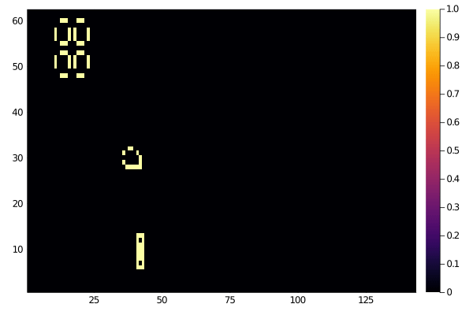

# Cells.jl

Cellular automata in Julia, still in development.

## Currently Available

- ECA - [Elementary Cellular Automata](https://en.wikipedia.org/wiki/Elementary_cellular_automaton)
- [Game of Life](https://en.wikipedia.org/wiki/Conway%27s_Game_of_Life)

## TODO

- [ ] Docstrings, detailed documentation
- [ ] GUI, more customization of display and visualization
- [ ] More automata
  - [ ] Other discrete 2D automata (different rules and grid geometries)
  - [ ] Continuous automata
- [ ] An algorithm for finding self-sustaining patterns for any given cellular automaton

